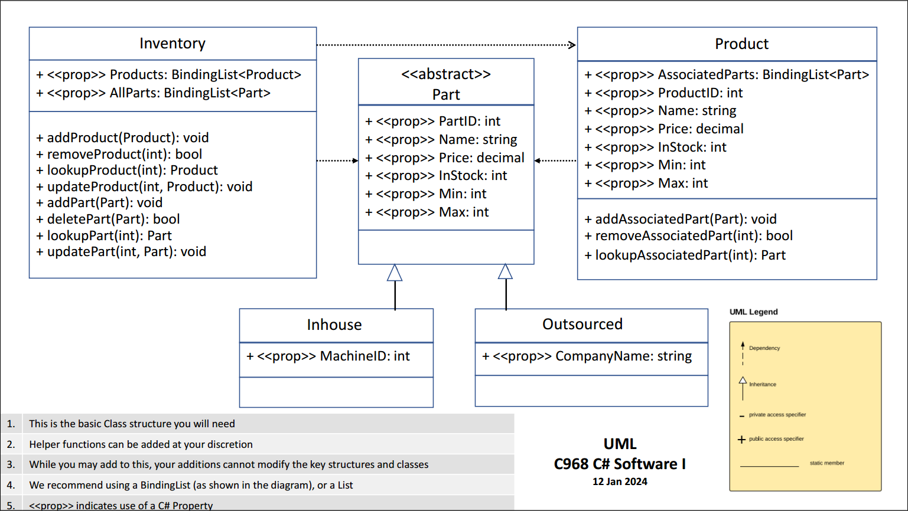
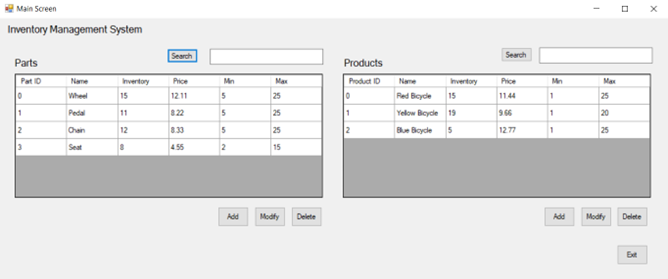
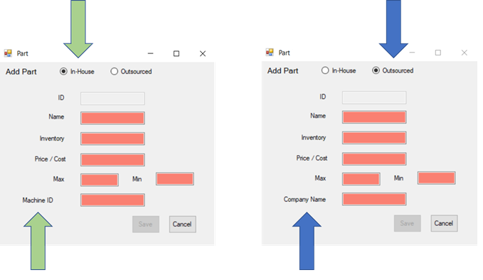
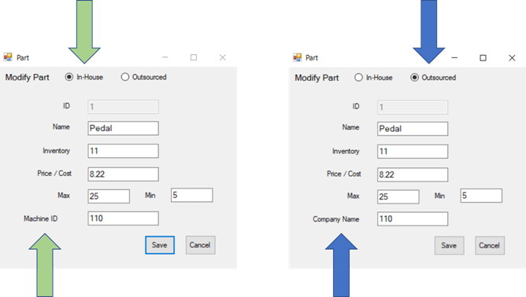
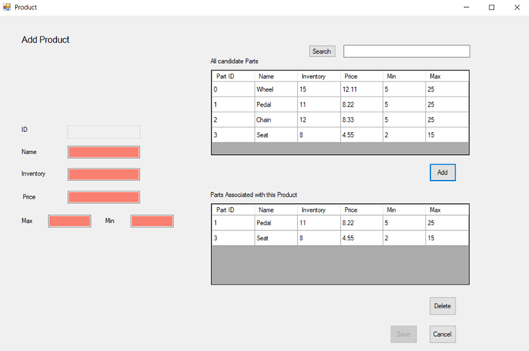
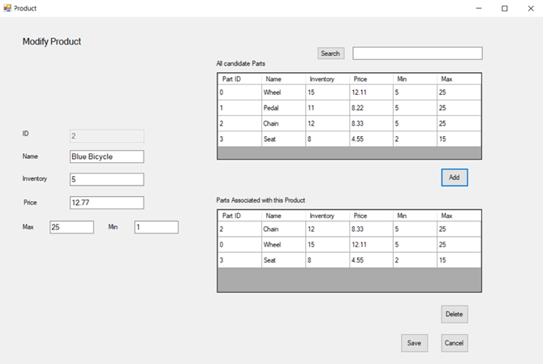

# Inventory Management System

## Overview

This project involves creating an advanced inventory management system for a small manufacturing organization. The organization has outgrown its current spreadsheet-based system and requires a sophisticated application to manage inventory additions, deletions, and other data efficiently. The application is designed to meet specific business requirements, utilizing a provided GUI mock-up and UML class diagram.

## Competencies

The development of this application demonstrates the following competencies:

- **Classes and Interfaces**: I designed software solutions with appropriate classes, objects, methods, and interfaces to achieve specific goals.
- **Object-Oriented Principles**: I implemented object-oriented design principles (e.g., inheritance, encapsulation, and abstraction) to ensure the application's scalability.
- **Application Development**: I produced applications using high-level programming language constructs to meet business requirements.
- **Exception Handling**: I incorporated simple exception handling to improve user experience and application stability.
- **User Interface Development**: I developed user interfaces to meet project requirements.

## Scenario

A small manufacturing organization needs an inventory management system to replace their manual, spreadsheet-based system. The new application will allow for efficient management of inventory data and improve overall operations. The system is developed based on a provided GUI mock-up and UML class diagram.

## Requirements

### User Interface

1. **Main Form**
   - Buttons for "Add," "Modify," "Delete," "Search" for parts and products, and "Exit."
   - Lists for parts and products.
   - Text boxes for searching parts and products.
   - Title labels for parts, products, and the application.

2. **Add Part Form**
   - Radio buttons for "In-House" and "Outsourced" parts.
   - Buttons for "Save" and "Cancel."
   - Text boxes for ID, name, inventory level, price, max and min values, and company name or machine ID.
   - Labels for the above fields and the form title.

3. **Modify Part Form**
   - Similar controls to the Add Part form, with fields populated with existing part data.

4. **Add Product Form**
   - Buttons for "Save," "Cancel," "Add" part, and "Delete" part.
   - Text boxes for ID, name, inventory level, price, and max and min values.
   - Labels for the above fields and the form title.
   - Grid views for all parts and parts associated with the product.
   - A "Search" button and a text field with an associated list for displaying search results.

5. **Modify Product Form**
   - Similar controls to the Add Product form, with fields populated with existing product data.

### Classes

- I implemented classes, methods, and properties as specified in the UML Class Diagram.
- I added behaviors to forms to manage parts and products (add, modify, delete, search, and associate parts with products).
- I validated user input to ensure data integrity and prevent errors.

## Conclusion

This project highlights my ability to develop a fully-functional, user-friendly inventory management system using C#. It demonstrates competencies in object-oriented design, application development, user interface development, and exception handling.

## UML Class Diagram

Below is the UML class diagram for the project:

You can also view the PDF version [here](UML%20Class%20Diagram.pdf).

## GUI Mockup

Here are the mockups of the project's GUI screens:

### Main Screen

The "Main Screen" displays the current table of parts and the current table of products. It allows the user to initiate an add or modify for the parts or products. It also allows the user to delete a part or a product. It allows a user to search for particular parts or products. "Exit" shuts down the app.

### Add Part Screen

The user uses this "Add Part" screen to add a part to the parts list by supplying information about the part and then selecting "Save." After a successful "Save," the user is returned to the main screen. If the user selects "Cancel," no part will be added to the parts list, and the screen will revert to the main screen. The user has the option to select "In-House" or "Outsourced" to categorize the part. If the user selects "Outsourced," the "Company Name" field is available. If the user selects "In-House," the "Machine ID" field is available.

### Modify Part Screen

The user uses this "Modify Part" screen to modify a part selected by the user that is already in the parts list by supplying information about the part and then selecting "Save." After a successful "Save," the user is returned to the main screen. If the user selects "Cancel," no modifications to the part in the parts list will be made, and the screen will revert to the main screen. The "Modify Part" screen has the same functionality as the "Add Part" screen, but the text boxes are populated with data from an existing part selected by the user.

### Add Product Screen

The user uses this "Add Product" screen to add a product to the products list by supplying information about the product and then selecting "Save." After a successful "Save," the user is returned to the main screen. If the user selects "Cancel," no product will be added to the products list, and the screen will revert to the main screen. The "Add Product" screen allows the user to select and add parts from the upper grid to the associated parts list in the lower grid. The user can also delete parts from the lower grid.

### Modify Product Screen

The user uses this "Modify Product" screen to modify a product selected by the user that is already in the products list by supplying information about the product and then selecting "Save." After a successful "Save," the user is returned to the main screen. If the user selects "Cancel," no modifications to the product in the products list will be made, and the screen will revert to the main screen. The "Modify Product" screen has the same functionality as the "Add Product" screen, but the parts and fields are populated with data from an existing product selected by the user.

---

For more details, refer to the following documents:
- [Requirements Document](Requirements.pdf)
- [GUI Mock-Up Document](GUI%20Mock%20up.docx)
- [UML Class Diagram](UML%20Class%20Diagram.pdf)
